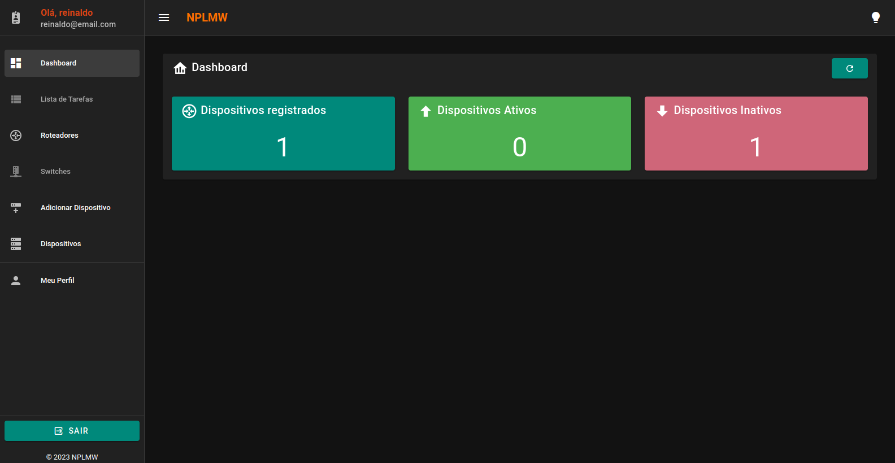
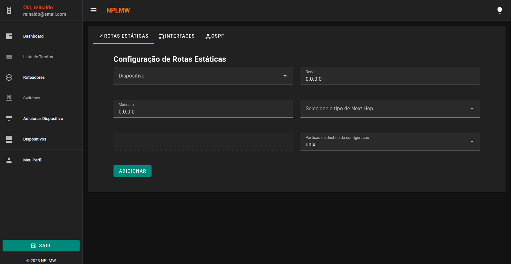
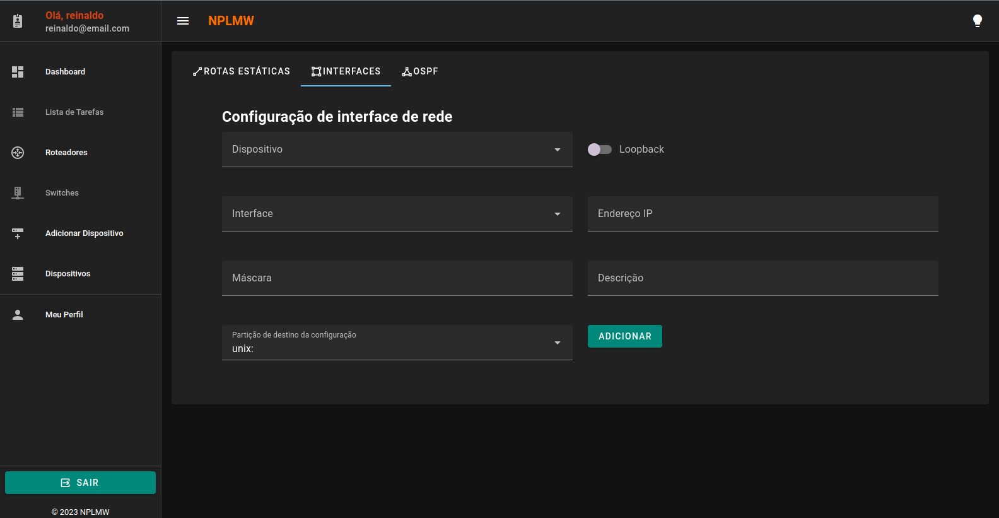
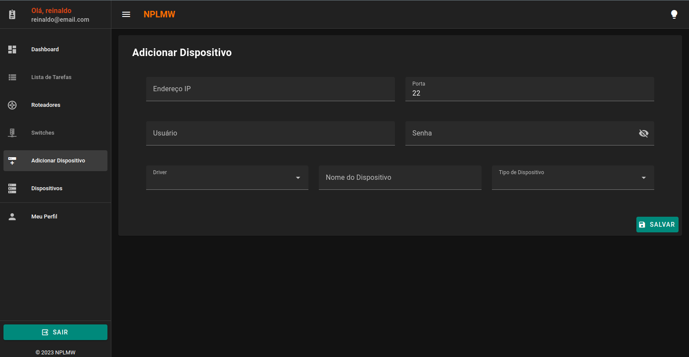
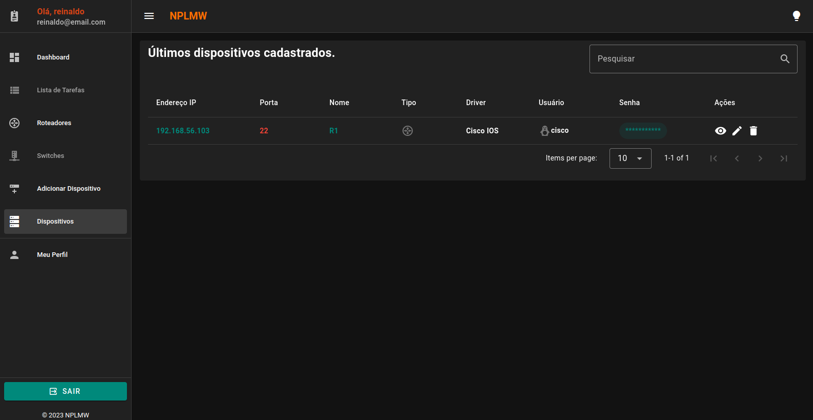

# NPLMW (NAPALM Web Application)

## Descrição
O NPLMW é uma aplicação web que tem como objetivo facilitar a configuração de equipamentos de rede, utilizando o NAPALM como ferramenta de automação.

## Requisitos
- Docker
- Docker Compose

## Installation
1. Clone o repositório
2. Execute o comando `docker-compose up -d --build`

## Utilização
1. Acesse o endereço `http://localhost:3000` no seu navegador.
2. Crie um novo usuário e faça login na aplicação.

## Apresentação

## Solução

A solução proposta foi desenvolvida utilizando os frameworks [Vuetify](https://vuetifyjs.com), [FastAPI](https://fastapi.tiangolo.com) e o [NAPALM](https://napalm.readthedocs.io/en/latest/). O Vuetify foi utilizado para o desenvolvimento do frontend da aplicação, o FastAPI foi utilizado para o desenvolvimento do backend e o NAPALM foi utilizado para a comunicação com os equipamentos de rede.

## Funcionalidades

- [x] Autenticação de usuários
- [x] Registro de dispositivos
- [x] Configuração de dispositivos
- [x] Listagem de dispositivos

## Funcionalidades futuras

- [ ] Configuração de múltiplos dispositivos.
- [ ] Suporte para outros equipamentos de rede.
- [ ] Configuração de protocolos de roteamento (OSPF, BGP, EIGRP, etc).
- [ ] Configuração de VLANs.

## Autores
- [Reinaldo Silva](https://github.com/mr-reinaldo)

## Licença
[MIT](https://github.com/mr-reinaldo/NPLMW/blob/main/LICENSE)
